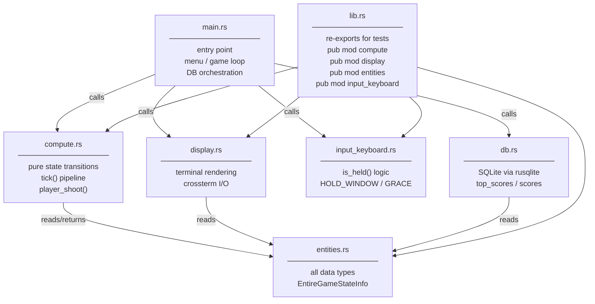
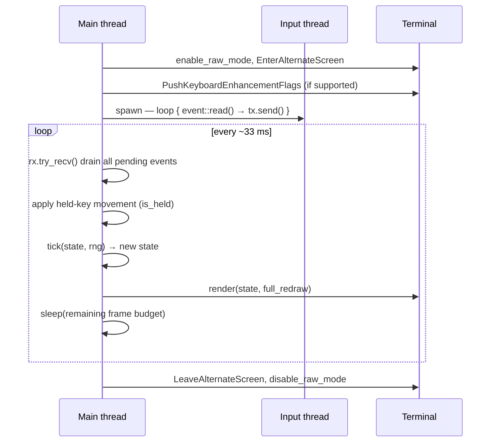
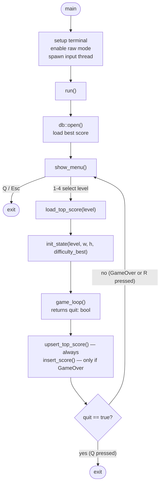
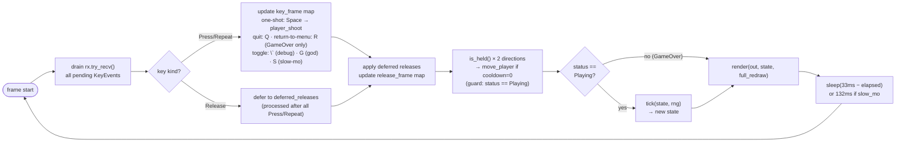
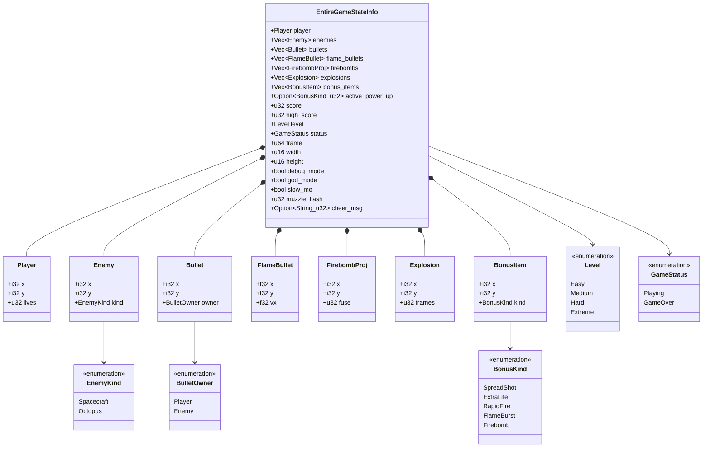
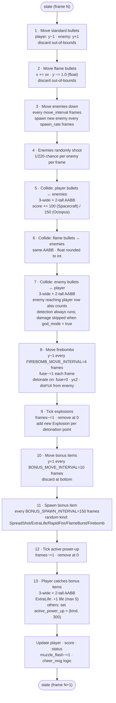
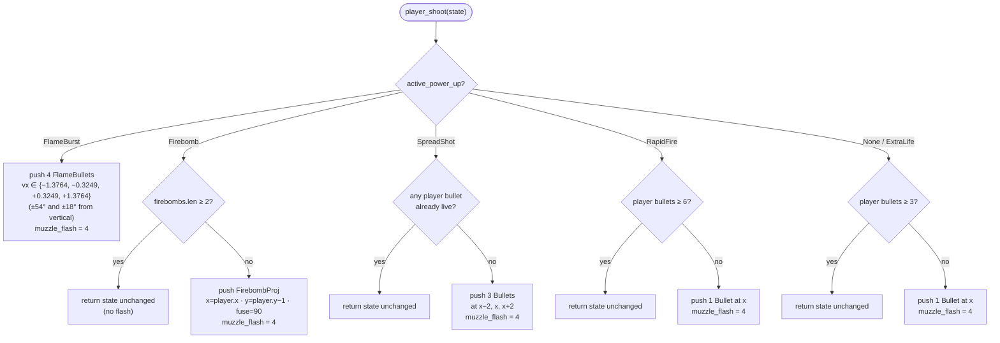
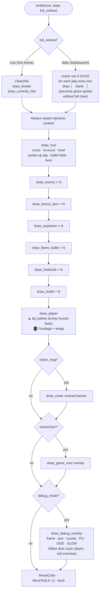
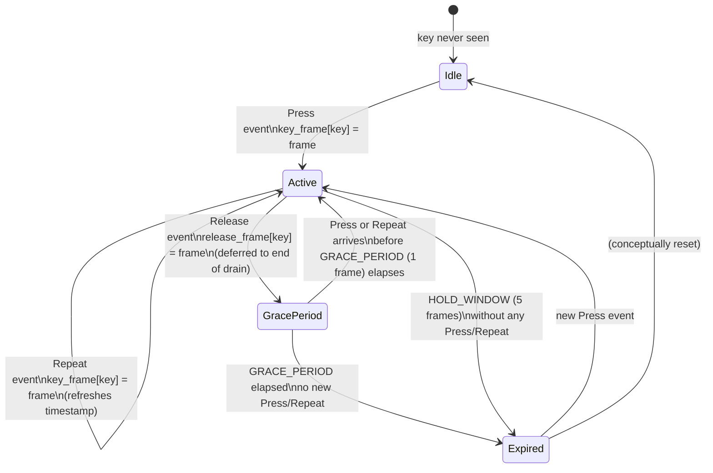
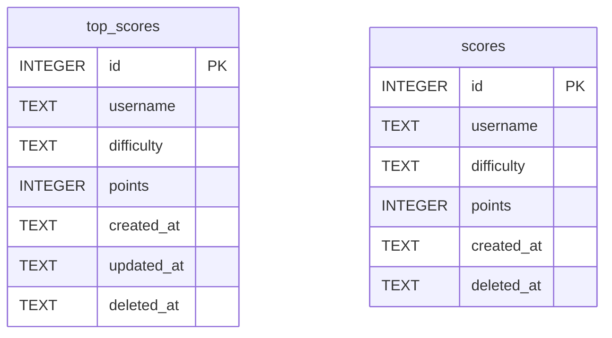

# Architecture

## Module map



The design enforces a strict dependency direction: **entities** has no imports from the project; **compute** only imports from **entities**; **display** only imports from **entities**; **main** wires them together.

---

## Concurrency model

Two OS threads run for the lifetime of the program.



`crossterm::event::read()` blocks in the input thread. The main thread uses `rx.try_recv()` (non-blocking) so it never stalls on I/O.

---

## Application flow



`game_loop` returns `true` when Q is pressed (exit program) and `false` when R is pressed on GameOver (return to menu). Either way `upsert_top_score` is called unconditionally in `run()` after `game_loop` returns. `insert_score` is only called when `state.status == GameStatus::GameOver`.

---

## Game loop — one frame



---

## State — data model



`EntireGameStateInfo` is a plain `Clone`-able struct with no methods. Every compute function takes `&EntireGameStateInfo` and returns a new `EntireGameStateInfo` via struct-update syntax (`..state.clone()`). Nothing is mutated in place inside `compute.rs`.

---

## tick() pipeline — 13 steps per frame



---

## Weapon firing — player_shoot()



---

## Rendering pipeline



Draw order matters: explosions are painted before flame bullets, which are before standard bullets, which are before the player. This means the player sprite is never occluded by its own projectiles.

---

## Input — key-held detection



`is_held(key_frame, release_frame, key, frame)` returns `true` when:
- `key_frame[key]` exists AND `frame − last_press ≤ HOLD_WINDOW (5)`, AND
- either no release was recorded, OR `last_press ≥ last_release` (re-pressed after release), OR `frame − last_release ≤ GRACE_PERIOD (1)`.

The GRACE_PERIOD works around a Ghostty/Kitty-protocol quirk: pressing Space while holding a direction fires a spurious Release event for the direction key.

---

## Database schema



`top_scores` has `UNIQUE(username, difficulty)`. The upsert uses `ON CONFLICT DO UPDATE SET points = MAX(points, excluded.points)` so it is safe to call unconditionally after every game — SQL handles the "only update if higher" logic.

`scores` is append-only history; one row per completed game regardless of rank.

`difficulty` is stored as a lowercase string (`easy` / `medium` / `hard` / `extreme`) so the DB is readable without the Rust source.

SQLite is compiled from source via `rusqlite` with the `bundled` feature — no system SQLite or C library installation is required beyond a C compiler toolchain.

---

## Difficulty parameters

| Level   | Enemy move interval (frames) | Enemy spawn rate (frames) | Effective speed at 30 FPS |
|---------|------------------------------|---------------------------|---------------------------|
| Easy    | 22                           | 130                       | ~1.4 rows/sec             |
| Medium  | 14                           | 90                        | ~2.1 rows/sec             |
| Hard    | 8                            | 55                        | ~3.8 rows/sec             |
| Extreme | 4                            | 28                        | ~7.5 rows/sec             |

Power-up duration is fixed at 300 frames (≈10 s) for all timed power-ups across all difficulties.

---

## Sprite layout and hitboxes

```
Row y:    ▲        ← player tip       (◎)   «▼»   ← enemy row 0
Row y+1: /█\       ← player fuselage  ╰─╯   ╚═╝   ← enemy row 1

Hitbox for both player and every enemy: 3 wide × 2 tall
  centre x ± 1  ×  row y and row y+1
```

Collision in `tick()` uses integer AABB: `|bx − ex| ≤ 1 && (by == ey || by == ey+1)`.

`FlameBullet` positions are `f32`; they are rounded to `i32` before the AABB check so the same integer arithmetic applies.

---

## Key constants (compute.rs)

| Constant | Value | Meaning |
|---|---|---|
| `FRAME` | 33 ms | Target frame duration (≈30 FPS) |
| `MOVE_COOLDOWN` | 0.1 | Cooldown set after each held move; decremented by 1.0/frame so it reaches 0 the same frame it's set — effectively no cooldown (moves every frame) |
| `POWER_UP_DURATION` | 300 frames | ≈10 s for all timed power-ups |
| `BONUS_SPAWN_INTERVAL` | 150 frames | ≈5 s between bonus drops |
| `BONUS_MOVE_INTERVAL` | 10 frames | Bonus falls 1 row every 10 frames |
| `MAX_LIVES` | 5 | Player lives cap |
| `MUZZLE_FLASH_DURATION` | 4 frames | ≈132 ms yellow burst at player tip |
| `CHEER_DURATION` | 90 frames | ≈3 s score-milestone banner |
| `FLAME_VX_NEAR` | 0.3249 | tan(18°) — inner FlameBurst angle |
| `FLAME_VX_FAR` | 1.3764 | tan(54°) — outer FlameBurst angle |
| `FIREBOMB_MOVE_INTERVAL` | 4 frames | Firebomb rises 1 row every 4 frames |
| `FIREBOMB_FUSE` | 90 frames | ≈3 s before auto-detonation |
| `FIREBOMB_CAP` | 2 | Max simultaneous firebombs |
| `EXPLOSION_TRIGGER_RADIUS_SQ` | 4 | r=2 — proximity auto-detonation radius² |
| `EXPLOSION_KILL_RADIUS_SQ` | 16 | r=4 — blast kill radius² |
| `EXPLOSION_DISPLAY_FRAMES` | 10 frames | ≈333 ms explosion visual |
| `HOLD_WINDOW` | 5 frames | `is_held` expiry window |
| `GRACE_PERIOD` | 1 frame | False-release suppression window |
